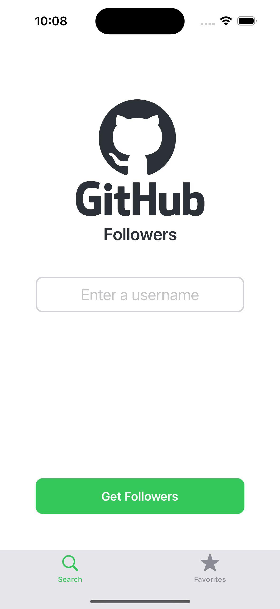

# GitHub Followers

GitHub Followers is an iOS application built using UIKit that allows users to search for any GitHub account, view its followers, and mark accounts as favorites. 
The app follows the MVVM architecture pattern and supports dark mode.

---

## 📖 About

The **GitHub Followers** app provides the following features:

- **Search GitHub Accounts:**  
  Search for any GitHub account by username.

- **View Followers:**  
  View a list of followers for the searched GitHub account.

- **Account Details:**  
  Tap on any follower's account to view detailed information.

- **Favorites:**  
  Add any GitHub account to your favorites for quick access.

- **Dark Mode Support:**  
  Seamless support for light and dark modes, adapting to system preferences.

---

## 📱 Screens

1. **GitHub Account Search Screen:**  
   - Search for any GitHub account using the username.

2. **GitHub Account Followers Listing Screen:**  
   - Displays a list of followers.
   - Tap on any follower to view detailed information.

3. **GitHub Favorites Account Listing Screen:**  
   - Displays a list of accounts marked as favorites.
   - Easy access to frequently viewed accounts.

---

## ✨ Features

- **MVVM Architecture:**  
  Utilizes the MVVM (Model-View-ViewModel) pattern to maintain a clean separation of concerns.

- **Network Calls:**  
  Asynchronous network requests to fetch GitHub user data and followers.

- **Programmatic UI:**  
  The user interface is built programmatically without Storyboards or XIBs.

- **Dark Mode Support:**  
  Consistent and adaptive support for light and dark modes.

---

## 🛠️ Tech Stack

- **UIKit:** UI Framework for building the user interface programmatically.
- **MVVM Architecture:** Separation of UI, business logic, and data management.

---

## 🚀 Getting Started

To run this project locally:

1. **Clone the repository:**
    ```bash
    git clone https://github.com/your-username/github-followers.git
    ```

     ```bash
    cd github-followers
    ```

2. **Open in Xcode:**
    ```bash
    open GitHubFollowers.xcodeproj
    ```

3. **Build and Run:**  
   - Ensure you have the latest version of Xcode installed.
   - Select a simulator or a connected device.
   - Click on **Run** or press `Cmd + R`.

---

## 📸 Screenshots

<p align="center">
    
  
  
    
</p>

---
